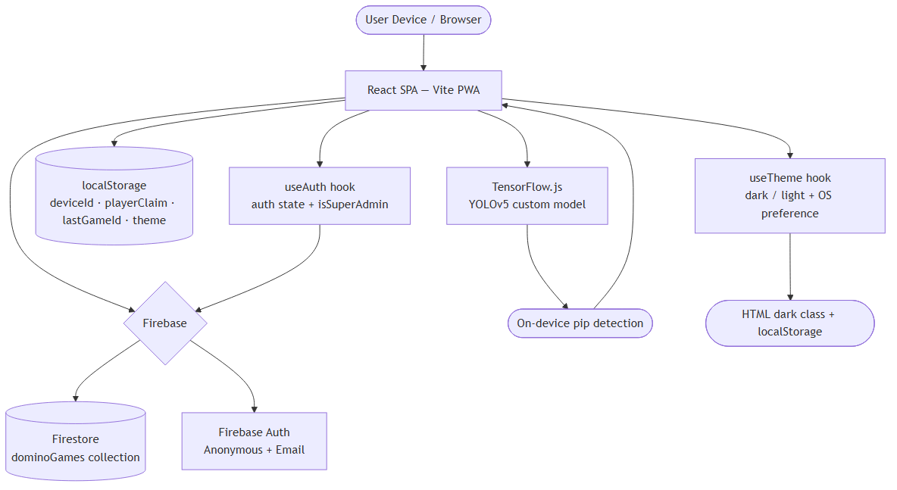
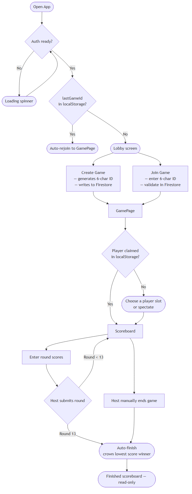
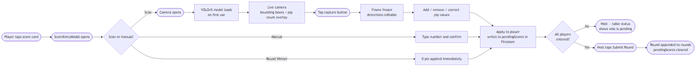
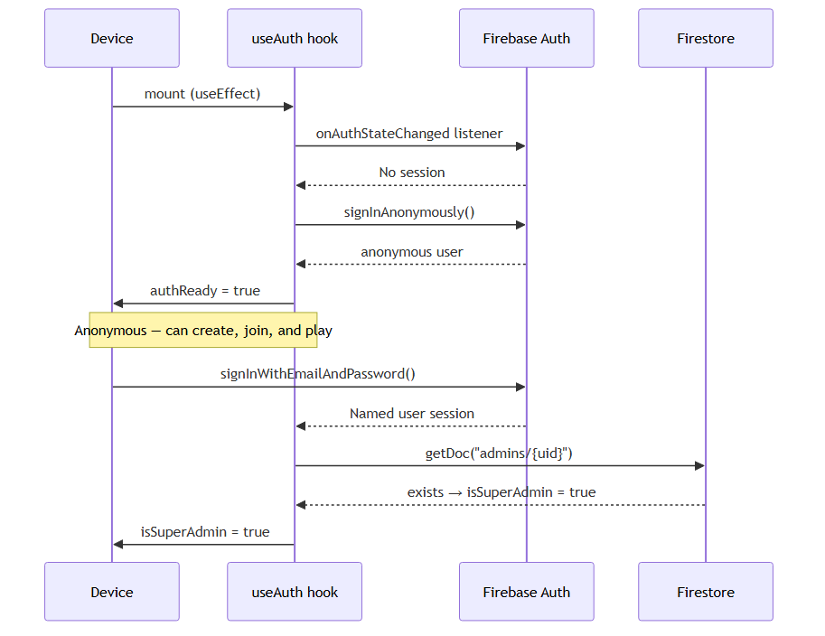
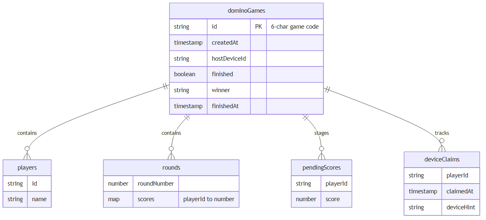
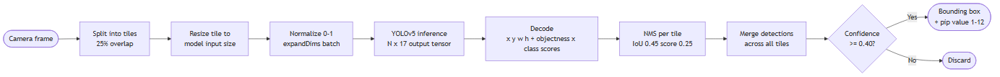
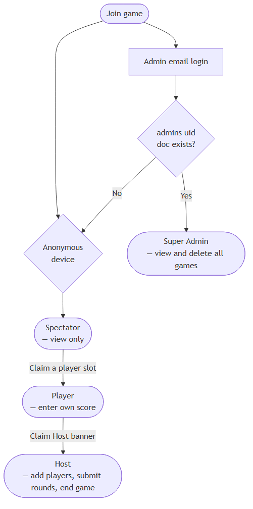

# Domino Suite — Application Documentation

> **Stack:** React 19 · Firebase 10 (Firestore + Auth) · TensorFlow.js · Tailwind CSS v4 · Vite · PWA
> **Version:** 1.5.0 · Last updated: 2026-05-06

> **Recent changes (v1.5.0):** Dark mode, `useAuth` hook, `useTheme` hook, custom `ConfirmDialog`, page routing split into `LobbyPage`/`GamePage`, backwards-compatible player claim validation, deferred auto-rejoin until after Firebase auth is ready.

---

## Executive Summary

Domino Suite is a real-time, multi-device scoreboard for **Mexican Train Dominoes** (13 rounds). Players join a shared game via a 6-character code, each enter their own round score from their own phone, and the host submits the round. An on-device AI camera (YOLOv5 + TensorFlow.js) counts pip values automatically from a photo — no server-side inference required.

---

## System Architecture



---

## Application Flows

### 1. Game Lifecycle



### 2. Score Entry Flow



### 3. Authentication & Role Model



**`useAuth` hook** ([src/lib/useAuth.js](src/lib/useAuth.js)) — returns `{ authUser, isSuperAdmin, authReady, authError }`. Auto-rejoin and Firestore subscriptions in `LobbyPage` and `GamePage` are both gated behind `authReady` to prevent race conditions on first load.

---

## Data Model — Firestore

### Collection: `dominoGames`



| Field | Type | Description |
|---|---|---|
| `createdAt` | Timestamp | Game creation time |
| `hostDeviceId` | string | Device ID of the current host |
| `players` | `{id, name}[]` | All players in the game |
| `rounds` | `{roundNumber, scores}[]` | Completed round data |
| `pendingScores` | `{playerId: number}` | Scores staged for current round — cleared on submit |
| `pendingWinner` | string \| null | playerId marked as round winner (0 pts) |
| `deviceClaims` | `{playerId: {claimedAt, deviceHint}}` | Maps player slots to claiming devices |
| `finished` | boolean | Whether the game is locked |
| `winner` | string \| null | Winner's display name |
| `finishedAt` | Timestamp \| null | When the game ended |

### Collection: `admins`

Document ID = Firebase Auth UID. Existence alone grants Super Admin — no fields required.

---

## Hooks

| Hook | File | Returns | Description |
|---|---|---|---|
| `useAuth` | [src/lib/useAuth.js](src/lib/useAuth.js) | `{ authUser, isSuperAdmin, authReady, authError }` | Manages anonymous + email Firebase auth; checks `admins/{uid}` for super admin status. Gates all Firestore ops behind `authReady`. |
| `useTheme` | [src/lib/useTheme.js](src/lib/useTheme.js) | `{ theme, toggle }` | Reads `localStorage('theme')` and OS `prefers-color-scheme` on init. Applies/removes `dark` class on `<html>` and persists on change. |

---

## Component Reference

| Component | File | Responsibility |
|---|---|---|
| `App` | [src/App.jsx](src/App.jsx) | Root layout, `useTheme` toggle button, router |
| `LobbyPage` | [src/pages/LobbyPage.jsx](src/pages/LobbyPage.jsx) | Create/join entry point, auto-rejoin (deferred until `authReady`) |
| `GamePage` | [src/pages/GamePage.jsx](src/pages/GamePage.jsx) | Game state orchestrator, player claim, score submission |
| `Lobby` | [src/components/Lobby.jsx](src/components/Lobby.jsx) | Lobby UI, admin panel, update log |
| `Scoreboard` | [src/components/Scoreboard.jsx](src/components/Scoreboard.jsx) | Score table, round entry, host controls |
| `PlayerClaimScreen` | [src/components/PlayerClaimScreen.jsx](src/components/PlayerClaimScreen.jsx) | Player slot selection on first join |
| `PipTracker` | [src/components/PipTracker.jsx](src/components/PipTracker.jsx) | Live camera, AI detection, capture & review |
| `ScoreEntryModal` | [src/components/ScoreEntryModal.jsx](src/components/ScoreEntryModal.jsx) | Per-player score entry modal (manual + scan + round winner) |
| `UpdateLog` | [src/components/UpdateLog.jsx](src/components/UpdateLog.jsx) | Collapsible version changelog |
| `ConfirmDialog` | [src/components/ConfirmDialog.jsx](src/components/ConfirmDialog.jsx) | Accessible confirmation modal — replaces all native `confirm()` dialogs |

---

## AI Pip Detection — Technical Notes

**Model:** Custom YOLOv5 exported to TensorFlow.js GraphModel format, served from `/yolov5_custom/model.json`.



| Parameter | Value |
|---|---|
| Classes | 12 (pip values 1–12) |
| Per-tile NMS IoU threshold | 0.45 |
| Per-tile NMS score threshold | 0.25 |
| Post-merge confidence gate | 0.40 |
| Tile overlap | 25% |
| Inference location | On-device — no network calls |

---

## Role System



| Role | How assigned | Capabilities |
|---|---|---|
| **Spectator** | Default on join | View scoreboard only |
| **Player** | Claimed a player slot | Enter own pending score |
| **Host** | `hostDeviceId` matches device | Add players, enter all scores, submit rounds, end/delete game |
| **Super Admin** | Email login + `admins/{uid}` doc exists | View & delete all games across all sessions |

Any device can steal Host by tapping the "Claim Host" banner — overwrites `hostDeviceId` in Firestore.

---

## ConfirmDialog

[src/components/ConfirmDialog.jsx](src/components/ConfirmDialog.jsx) — reusable modal that replaced all native `window.confirm()` calls. Fully accessible: `role="dialog"`, `aria-modal`, `aria-labelledby`, `aria-describedby`. Auto-focuses Cancel on open; `Escape` key cancels.

| Prop | Type | Default | Description |
|---|---|---|---|
| `open` | boolean | — | Controls visibility |
| `title` | string | — | Dialog heading |
| `message` | string | — | Body text |
| `confirmLabel` | string | `'Confirm'` | Confirm button text |
| `variant` | `'danger' \| 'brand'` | `'danger'` | Red destructive vs violet brand style |
| `onConfirm` | function | — | Called on confirm |
| `onCancel` | function | — | Called on cancel or Escape |

---

## Dark Mode

`useTheme` controls dark mode globally. Theme preference is resolved in this order:

1. `localStorage('theme')` — explicit user preference
2. `window.matchMedia('(prefers-color-scheme: dark)')` — OS preference
3. Default: `'light'`

The `toggle()` function flips between `'dark'` and `'light'`, persists to `localStorage`, and adds/removes the `dark` class on `<html>`. All components use Tailwind `dark:` variants — no runtime CSS-in-JS.

---

## Local Storage Keys

| Key | Value | Purpose |
|---|---|---|
| `dominoDeviceId` | random string | Persistent per-device identity |
| `dominoLastGameId` | 6-char game ID | Auto-rejoin on next app open |
| `dominoPlayerClaim_{gameId}` | JSON `{id, name}` | Remembers which player this device claimed |
| `theme` | `'dark' \| 'light'` | Persisted user theme preference |

---

## Development

```bash
# Install
npm install

# Dev server (hot reload)
npm run dev

# Production build
npm run build

# Lint
npm run lint

# Preview production build
npm run preview
```

**URL routing:** `/` → Lobby · `/:gameId` → Game
**Firebase project:** `domino-score-tracker`
**PWA:** Configured via `vite-plugin-pwa`; caching intentionally disabled so the latest version always loads.
